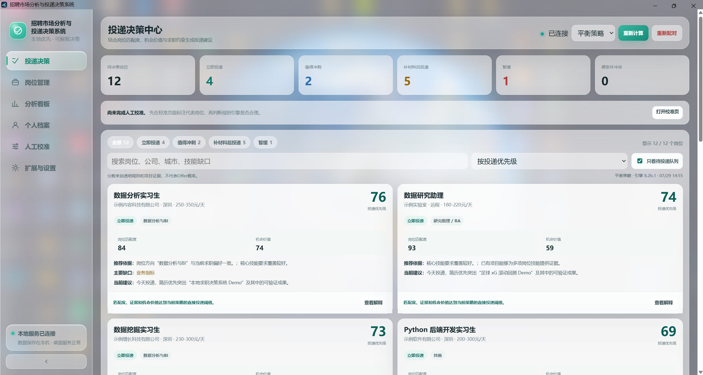
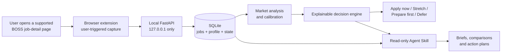

# Job Market Reality Check

Local-first Windows desktop software that turns collected job postings and
user-provided evidence into **explainable application priorities**.

不是又一个职位收藏夹，而是帮你回答：**“以我现在的条件，优先投哪些？为什么？”**

[](https://github.com/Xixiaogu/job-market-reality-check/actions/workflows/ci.yml) [](https://github.com/Xixiaogu/job-market-reality-check/releases/latest) [](https://github.com/Xixiaogu/job-market-reality-check/tree/skill-v0.1.0) [](https://github.com/Xixiaogu/job-market-reality-check) [](LICENSE)

## Download v1.0.7

- [Portable Windows ZIP](https://github.com/Xixiaogu/job-market-reality-check/releases/download/v1.0.7/JobMarketDecisionSystem-v1.0.7-desktop-windows-x64.zip) ([SHA256](https://github.com/Xixiaogu/job-market-reality-check/releases/download/v1.0.7/JobMarketDecisionSystem-v1.0.7-desktop-windows-x64.zip.sha256))
- [Per-user Windows installer](https://github.com/Xixiaogu/job-market-reality-check/releases/download/v1.0.7/JobMarketDecisionSystem-Setup-v1.0.7.exe) ([SHA256](https://github.com/Xixiaogu/job-market-reality-check/releases/download/v1.0.7/JobMarketDecisionSystem-Setup-v1.0.7.exe.sha256))
- [Release notes and all assets](https://github.com/Xixiaogu/job-market-reality-check/releases/tag/v1.0.7)

> **Before installing:** Windows only. The binaries are not code-signed, so
> Windows may show an unknown-publisher warning. The browser extension is
> loaded manually in developer mode.

> **Collection scope:** v1.0.7 currently supports user-triggered capture from
> BOSS直聘 job-detail pages only. Other recruitment sites, list-page crawling
> and unattended bulk collection are not supported.



_Decision Center in Windows Acrylic mode. Every company, job and profile
value shown is fictional._

## Why this project

Most job tools stop after saving a posting. This project asks a harder question:

> Given my actual skills, project evidence, availability and constraints, which jobs should I apply to now—and why?

The product keeps evidence and decisions separate. Job facts, candidate facts and manual labels live in local SQLite; the decision engine produces transparent dimensions and four action groups; the read-only Agent Skill explains those results without reimplementing the scoring logic.

## Product loop



## What is implemented

- User-triggered capture from supported BOSS直聘 job-detail pages, with local
  deduplication, revision history, notes and application-state tracking.
- Market-sample analysis across salary, city, education, role type and skill
  requirements.
- Candidate evidence profile plus manual calibration on representative jobs.
- Explainable ranking across match, opportunity value, preparation cost and
  risk, grouped into `apply_now`, `stretch`, `prepare_first` and `defer`.
- Windows desktop packaging with Standard Light and Windows Acrylic
  appearances.
- A read-only `job-market-reality-check` Agent Skill backed by a frozen local
  API contract.

## Engineering highlights

| Area | Evidence |
|---|---|
| Architecture | Browser extension + TypeScript/WXT, FastAPI, SQLite, Python decision engine, Windows desktop packaging |
| Privacy | Localhost-only API, per-install token, local data directory, no telemetry |
| Reliability | One baseline command covers offline logic, API integration, desktop mode and Skill tests |
| Reproducibility | CI creates 12 fictional jobs and a fictional candidate profile; no private database is required |
| Release | Desktop v1.0.7 and Skill v0.1.0 are tagged; ZIP and installer smoke tests are part of the release gate |
| Agent boundary | The Skill can read only the documented API and cannot modify SQLite or trigger applications |

## Quick start

### Install and run

Choose the portable ZIP or per-user installer from the
[download section](#download-v107). The installer does not require
administrator privileges.

After first launch:

1. Open **Extensions & Settings**.
2. Load the bundled `browser-extension/chrome-mv3` folder from `chrome://extensions`.
3. Open a supported BOSS直聘 job-detail page and use the extension to capture
   it.
4. Complete the candidate profile, then open **Decision Center**.
5. For the portfolio look, select **Windows Acrylic** and restart the app.

See [the three-minute demo guide](docs/demo-guide.md).

### Run from source

Requirements: Windows, Python 3.11+, Node.js 22+ and npm.

```powershell
python -m pip install -e ".[desktop]"

Set-Location .\extension
npm ci
npm run build
Set-Location ..

python -m desktop.app
```

The development API documentation is available at `http://127.0.0.1:8765/docs` while the service is running.

## Run the complete public CI baseline

Create a database containing only fictional public-demo data:

```powershell
python .\scripts\create_ci_fixture.py `
  --output .build\ci-fixture\job_market.db
```

Then run the same core suite used by GitHub Actions:

```powershell
$python = (Get-Command python.exe).Source
powershell.exe -NoProfile -ExecutionPolicy Bypass `
  -File .\scripts\test.ps1 `
  -Version 1.0.7 `
  -PythonPath $python `
  -SourceDatabasePath .build\ci-fixture\job_market.db `
  -SkipPackaged `
  -SkipInstaller
```

The CI baseline contains 30 test groups across product contracts, offline
logic, Skill workflows, local API integration and desktop-mode behavior.
The full 32-group release gate additionally exercises the packaged EXE and
installer locally because those artifacts are not built in pull-request CI.
See [the test-suite guide](tests/README.md) for the directory conventions.

## Use the Agent Skill

The distributable Skill is in [`skills/job-market-reality-check`](skills/job-market-reality-check). It can analyze supplied CSV, JSON and JSONL files, or read a running desktop application:

```powershell
python .\skills\job-market-reality-check\scripts\local_api_client.py health
python .\skills\job-market-reality-check\scripts\local_api_client.py brief
```

The client accepts only loopback addresses, sends only `GET` requests and verifies pagination plus decision-run consistency. The endpoint, field, authentication and version guarantees are frozen in [the Skill API contract](docs/skill-v1-local-api-contract.md).

## Privacy and collection boundary

- User data stays under `%LOCALAPPDATA%\JobMarketDecisionSystem` in desktop mode.
- The FastAPI service listens on `127.0.0.1`; protected endpoints require `X-Job-Market-Token`.
- The browser extension reads the active supported BOSS直聘 job-detail page
  only after user action and sends data only to localhost.
- The repository, tests and CI use fictional `example.invalid` records. Real job databases, exports, tokens, logs and browser profiles are ignored.
- Users are responsible for complying with the recruitment platform's terms and applicable law. This project does not bypass login, CAPTCHA or access controls.
- The software does not submit applications, contact recruiters or perform bulk account actions.

Read [PRIVACY.md](PRIVACY.md) and [SECURITY.md](SECURITY.md) before using real data.

## Known limitations

- Windows is the supported desktop platform.
- BOSS直聘 job-detail pages are the only supported collection source in
  v1.0.7.
- The browser extension is loaded manually in developer mode.
- The installer is not code-signed and there is no automatic updater.
- Windows Acrylic requires a supported Windows 11 build and falls back to Standard Light when unavailable.
- Market analysis describes only the user's collected sample, not the entire hiring market.
- Decision scores are transparent heuristics based on recorded evidence, not offer probabilities.
- Skill v0.1.0 is read-only and intentionally cannot apply, message or edit desktop data.

## Repository map

<details>
<summary>Show the repository layout</summary>

```text
extension/                         browser collector (TypeScript + WXT)
desktop/                           Windows shell, runtime and native effects
local_api/                         FastAPI, SQLite and desktop web UI
pipeline/                          cleaning, analysis, audit and dashboard jobs
skills/job-market-reality-check/  read-only Agent Skill v0.1.0
tests/                             contracts, offline, API and release suites
scripts/                           run, test, fixture and build entry points
packaging/                         Windows ZIP and installer definitions
docs/                              architecture, contracts and release notes
pyproject.toml                     Python metadata and dependency groups
```

</details>

The desktop v1.0.7 business logic and scoring engine are frozen; see
[the baseline policy](docs/desktop-v1.0.7-baseline-freeze.md). Contributions
should start with [CONTRIBUTING.md](CONTRIBUTING.md).

## License

Released under the [MIT License](LICENSE).
